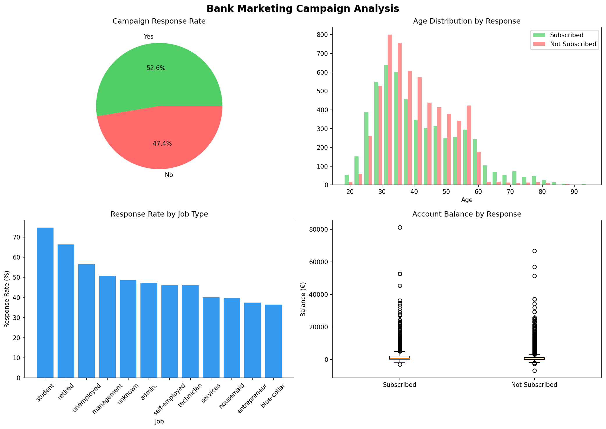

# Bank Marketing Campaign Analysis

## Problem Statement
Banks spend significant resources on telemarketing campaigns with low conversion rates.
This project analyzes 11,162 real customer records to identify which segments respond
best to term deposit campaigns — enabling smarter, data-driven targeting.

## Dataset
| Property | Details |
|---|---|
| Source | Kaggle — Bank Marketing Dataset |
| Records | 11,162 customers |
| Features | 17 columns |
| Target Variable | deposit (yes/no) |

Key features: age, job, marital status, education, account balance, campaign calls, previous outcome.

## Tech Stack
- **Language:** Python 3
- **Libraries:** Pandas, NumPy, Matplotlib, Seaborn
- **Environment:** Google Colab

## Approach
1. Loaded and explored raw dataset
2. Checked for missing values and data quality issues
3. Analyzed response rates across customer segments
4. Visualized key patterns using charts
5. Derived actionable business insights

## Key Findings
| Insight | Value |
|---|---|
| Overall Response Rate | 47.4% |
| Highest Segment (Student) | 74.7% |
| Subscribed Avg Balance | €1,804 |
| Non-subscribed Avg Balance | €1,280 |
| Best Campaign Month | May |

## Visualizations

## Business Recommendations
- **Target students and retired customers** — highest response rates
- **Focus campaigns in May** — peak subscription month
- **Higher balance customers** are 41% more likely to subscribe
- Reduce campaign calls to high-balance segments — quality over quantity

## Project Structure
